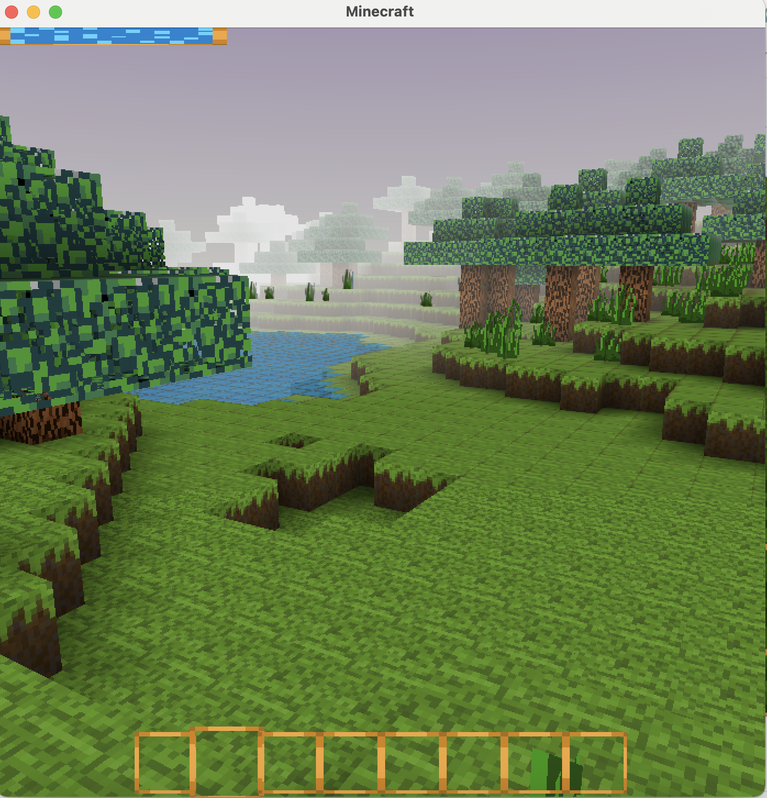

# Minecraft clone

A minecraft clone for me to practice 3d games & see how close I can get it to the real minecraft.

Uses OpenGL 3.3 and SDL for platform layer.

On Hiatus at the moment!

## Goals
- [x] Collision & physics
- [x] Block mining (need to add paticle efffects & gravity affected pickup blocks)
- [x] Clouds & Sky 
- [x] Ambient Occulsion of blocks - need to speed up
- [x] Tree & grasses generation
- [x] Water generation with alpha 
- [ ] Cows & Sheep Mobs
- [ ] Skeletal Animation of player & mobs
- [ ] Health, Stamina & Item Hotbar
- [ ] Cave generation
- [ ] Coal & Ore generation 
- [ ] Day & Night cycle
- [ ] Greedy meshing
- [ ] GJK with EPA when collision penetration
- [ ] Release game on itch.io as professional as possible - just exe & asset bundle 

## WHY's
- [x] Fun & Challenging to program
- [x] Get as good as I can at programming
- [x] Add to my projects list
- [x] Build confidence

 

## Building on Mac OS
run ```./run.sh``` to build and run the program. 

