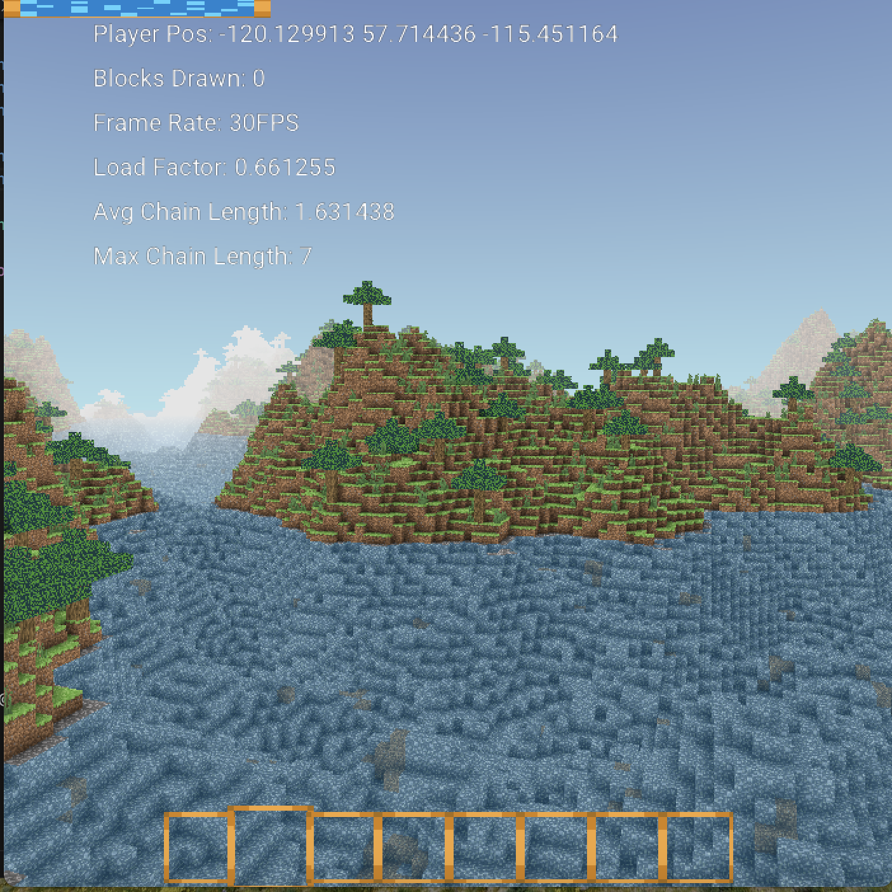

# Minecraft clone

A minecraft clone for me to practice 3d games & see how close I can get it to the real minecraft.

Uses OpenGL 3.3 and SDL for platform layer.

## Goals
- [x] Collision & physics
- [x] Block mining with paticle efffects
- [x] Clouds & Sky 
- [] Tree & grasses generation
- [] Basic cave generation
- [] Basic Coal & Ore generation 
- [] Cows & Sheep Mobs
- [] Health, Stamina & Item Hotbar
- [] Water generation with alpha 
- [] Day & Night cycle
- [] Skeletal Animation of player & mobs

## WHY's
- [x] Fun & Challenging to program
- [x] Get as good as I can at programming
- [x] Add to my projects list
- [x] Build confidence
 


## Building on Mac OS
run ```./run.sh``` to build and run the program. 

I haven't added any of the images so it won't run without them. 

